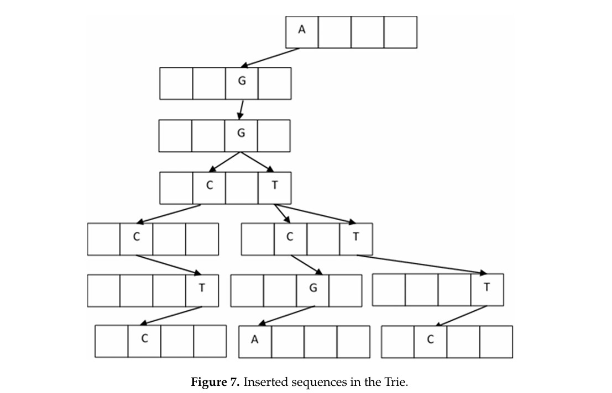

# DNA Assembler

## Description
The DNA Assembler is a Java program that implements a prefix tree (trie) data structure to assemble DNA fragments. It allows for the insertion of DNA fragments into the trie and provides functionality to extract contigs based on user-defined weight thresholds. The goal is to obtain the overlaps between DNA fragments in a efficient way.

## Features
- **Prefix Tree Implementation**: Utilizes a prefix tree to efficiently store and manage DNA fragments.
- **DNA Fragment Insertion**: Inserts DNA fragments into the prefix tree, ensuring validation of characters against the DNA alphabet(A, C, G, T), consisting of the four nitrogenous bases adenine (A),
- thymine (T), cytosine (C) and guanine (G).
- **Edge Weight Assignment**: Assigns a weight to each edge of the tree, representing the number of DNA fragments utilizing that edge.
- **Contig Extraction**: Extracts contigs from the tree based on a user-defined weight threshold, providing all paths with edge weights greater than or equal to the specified consensus.
- **Interactive Input**: Prompts the user to input DNA fragments during program execution, enhancing usability and flexibility.

## Usage
1. **Compilation**: Compile the program using a Java compiler (`javac DNAssembler.java`).
2. **Execution**: Run the compiled program (`java DNAssembler`).
3. **Insertion**: Input DNA fragments when prompted. The program will display the tree structure after each insertion.
4. **Contig Extraction**: Specify a weight threshold when prompted. The program will output contigs with edge weights greater than or equal to the specified threshold.

## Example
Suppose we have the following DNA fragments:
- AGGTCGA
- AGGTTTC
- AGGCCTC

After inserting these fragments and specifying a weight threshold, the program might output contigs like:
- AGG
- AGGT

## Requirements
- Java Development Kit (JDK) installed on your system.

